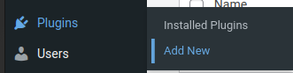
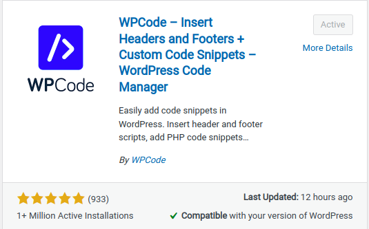
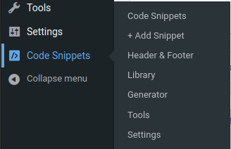
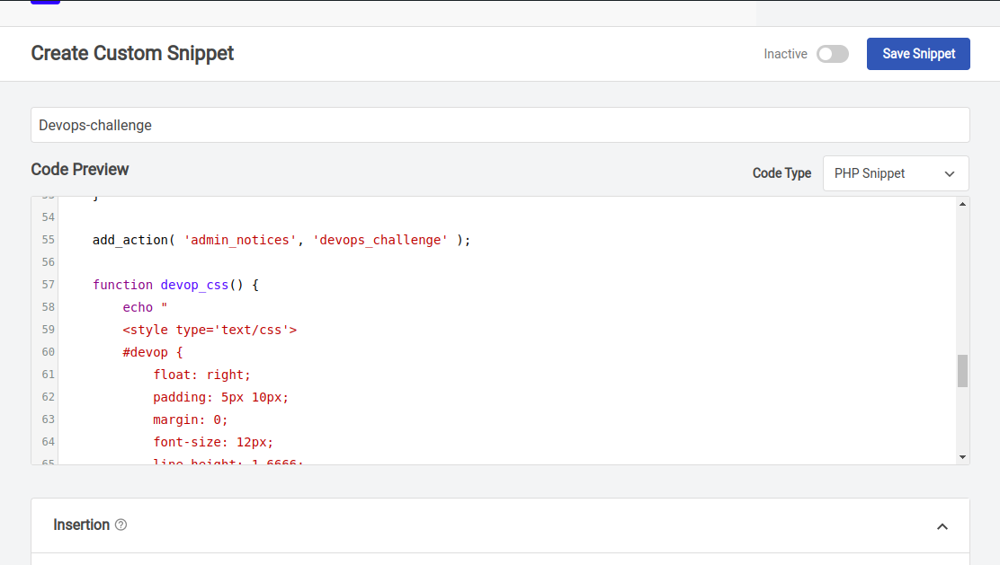
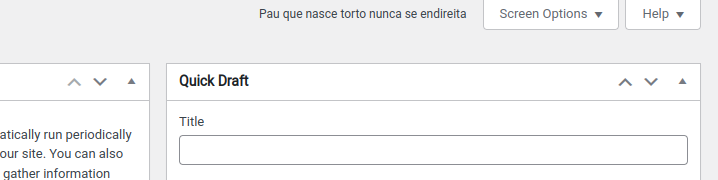
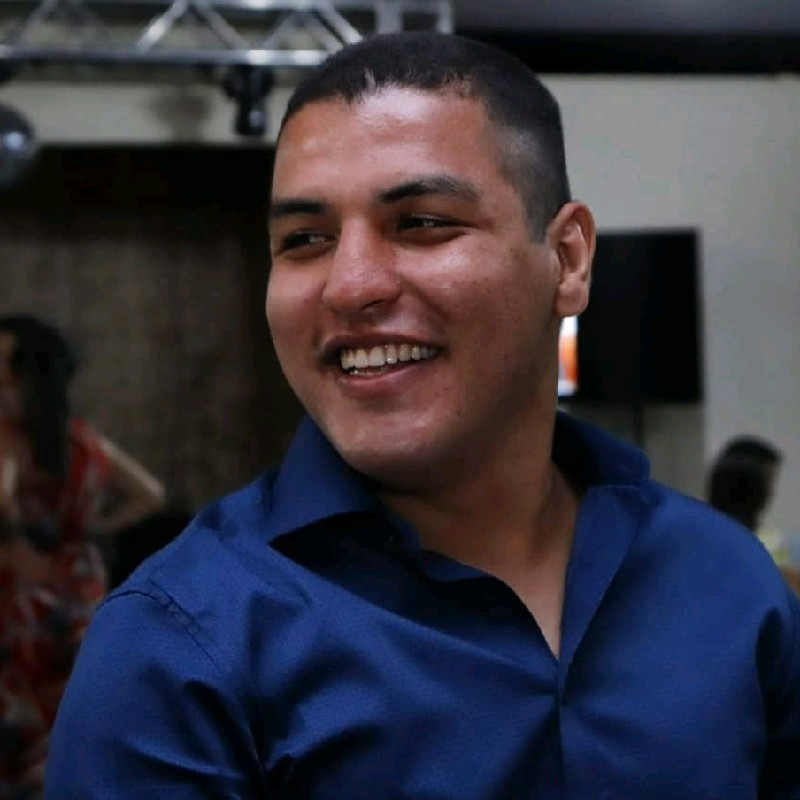

# Devops challenge júnior

Este repositório visa resolver o teste DevOps Challenge Júnior proposto pela Apiki WordPress

## Introdução:

Foram dados dois desafios, o Challenge Dev e Challenge Ops.

* Challenge Dev: Resolver os erros no [plugin](devops_challenge.php) em PHP
* Challenge Ops: Iniciar e configurar uma instância do WordPress no Amazon Lightsail

## → Challenge Dev:

#### Erros encontrados
- inclusão da tag de abertura e fechamento de arquivo PHP 
- Adição de ; ao final da linha 34  
- adição do método admin_notices  

## → Challenge Ops:

#### Iniciando e configurando a instância

- [x] Cadastrar-se na AWS
- [x] criar uma instância do WordPress no Lightsail
- [x] conectar-se à instância por SSH e obter a senha para o site WordPress
- [x] fazer login no painel de administração do site do WordPress
- [x] criar um endereço IP estático do Lightsail e anexe-o à instância do WordPress

#### Dados de acesso

**URL de acesso:** http://3.94.165.111/wp-admin/index.php  
**Login:** guest01  
**Senha:** 6WwO^1@stcxJbNA1Ickr6d7O  

#### Instalando o plugin no WordPress

1. Após logar no WordPress, vá em **Plugins > Add New**.  

2. Na barra de pesquisa, procure por wpcode e instale o plugin **WPCode – Insert Headers and Footers + Custom Code Snippets – WordPress Code Manager**.  

3. Após instalado, a opção Code Snippets aparecerá na barra lateral. Clique em **+ Add Snippet**  

4. Após isso, selecione a opção **Add Your Custom Code (New Snippet)**  

5. Quando a aba Create Custom Snippet aparecer, basta informar o **nome**, inserir o código do plugin em **Code Preview** e selecionar a opção **PHP Snippet** em Code Type.  

6. Ok, agora o plugin já está ativo, basta verificar o funcionamento no cabeçalho das páginas.  

## Sobre Mim

 &nbsp;

### João Felipe Mendes de Souza

- 23 anos
- Casado
- Valparaíso de Goiás - GO
- Estagiário de QA
- Formado em Administração, cursando Análise e Desenvolvimento de Sistemas
- Apaixonado pelo mundo open-source e em busca de uma oportunidade como DevOps Jr.
- Possuo uma biblioteca de 1200 livros

